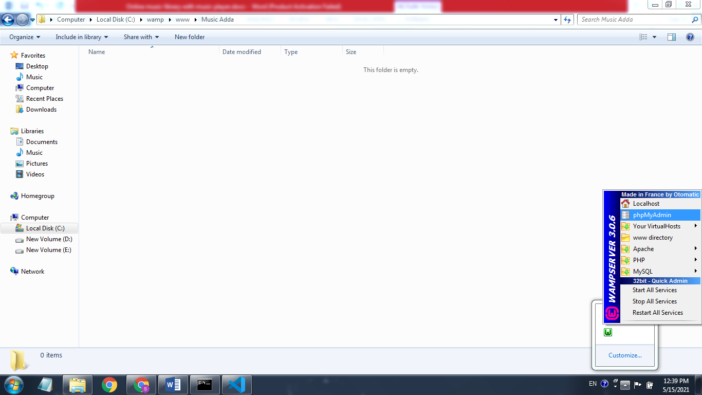
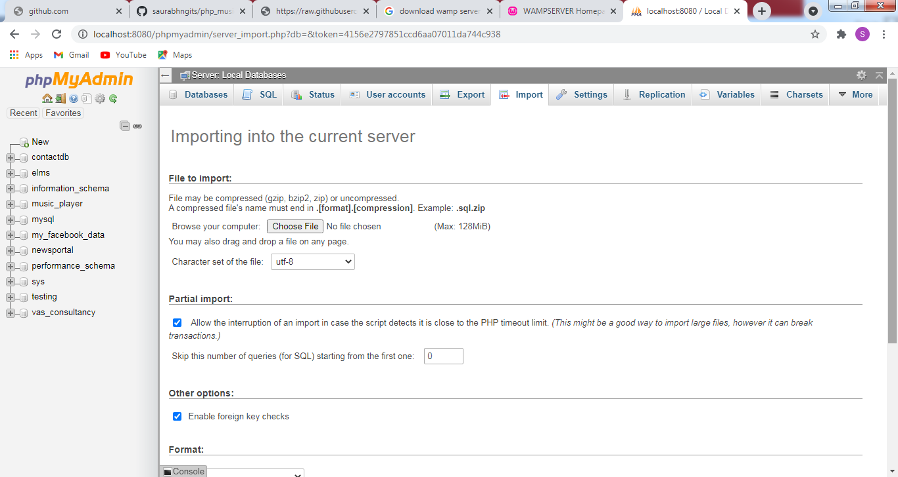
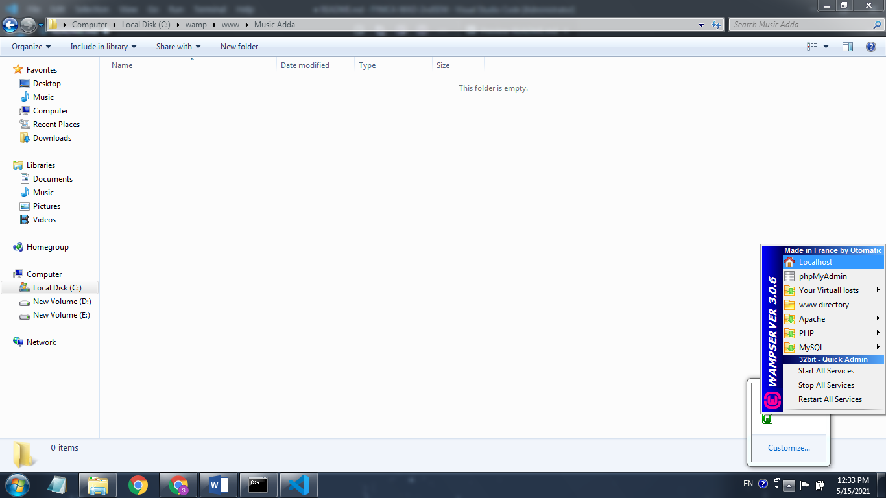
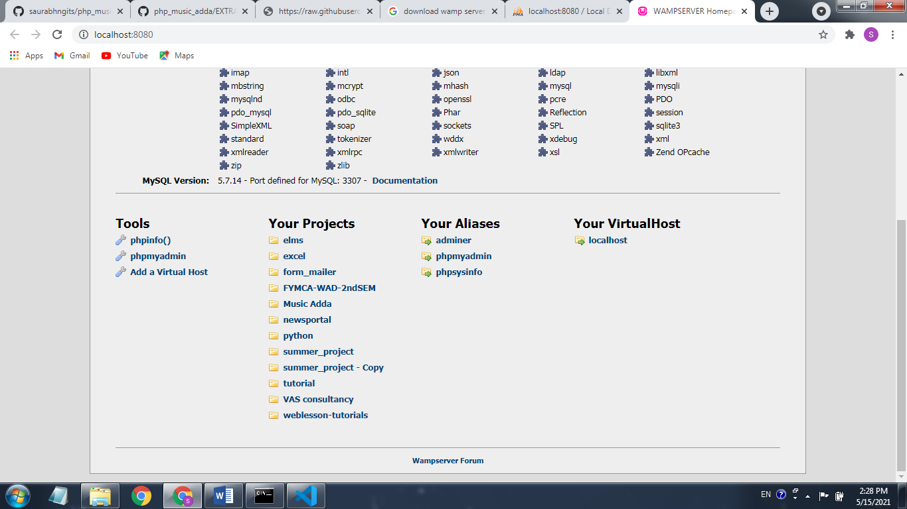
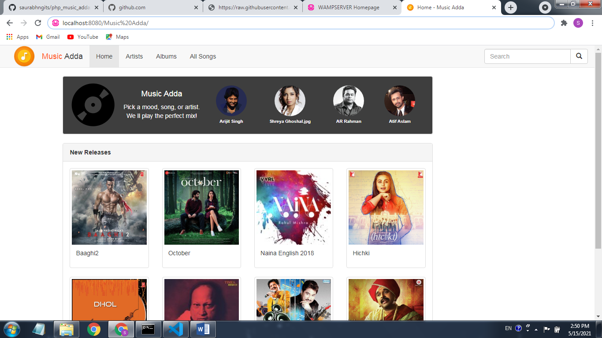

>   **Table of Contents** : 
>
> *[1. Pre-Requisites](#pre_requisites)*  
> *[2. Import Required SQL](#import_sql)*  
> *[3. Run Project](#run_project)*  
> *[4. Extra Documents](#extra_documents)*  
>  

 
 

# 1. Pre-Requisites 
Need to install [*WAMP Server*](https://sourceforge.net/projects/wampserver/files) on your system. ***WAMP Server*** a Windows Web development environment for `Apache`, `MySQL` and `PHP` databases.

 
 

 OR 
 

 

Need to install [**XAMPP Server**](https://sourceforge.net/projects/xampp) on your system. ***XAMPP Server*** is an easy to install Apache distribution containing `MySQL`, `PHP` and `Perl`.

 
 

# 2. Import Required SQL 

1. Create new folder with name ***Music Adda*** inside the ***root*** folder of ***WAMP*** or ***XAMPP*** server  and clone this repository into that folder.

    E.g. for ***WAMP*** in ***www*** folder:

        C:\wamp\www\Music Adda
    
     

2. Start ***WAMP*** server in your operating. On started you see it's ***icon*** in taskbar as shown in below image. Click on that icon and then click ***phpMyAdmin***.

 

 

This action will prompt to browser at address ***http://localhost:8080/phpmyadmin***.
Enter defualt ***Username*** as `root` and keep ***Password*** blank --> press ***Go***.

You will see below home page of ***phpMyAdmin***. 
Click on ***Import*** tab --> Click on ***Choose File*** --> Select ***music_player.sql*** from folder ***EXTRA DOCUMENTS*** of this repository -->  press ***Go***.

 

 

After these actions you can see on left hand side that ***music_player*** has been imported.

 
 

# 3. Run Project 

Again click on ***WAMP*** server icon in the taskbar then click ***Localhost*** as below.

 

 

This action will prompt to browser at address ***http://localhost:8080***.

 

 

Click on your project i.e. ***Music Adda*** will redirect to project index page.

 

 
 

# 4. Extra Documents 

Extra Documents are just to reference and to understand this project that you can remove later. It contain `ppt` and `doc` files and `images` that are used in this ***README*** file.
